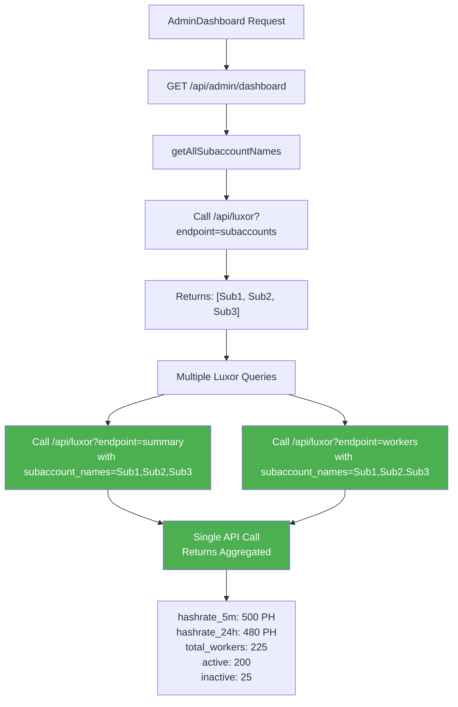
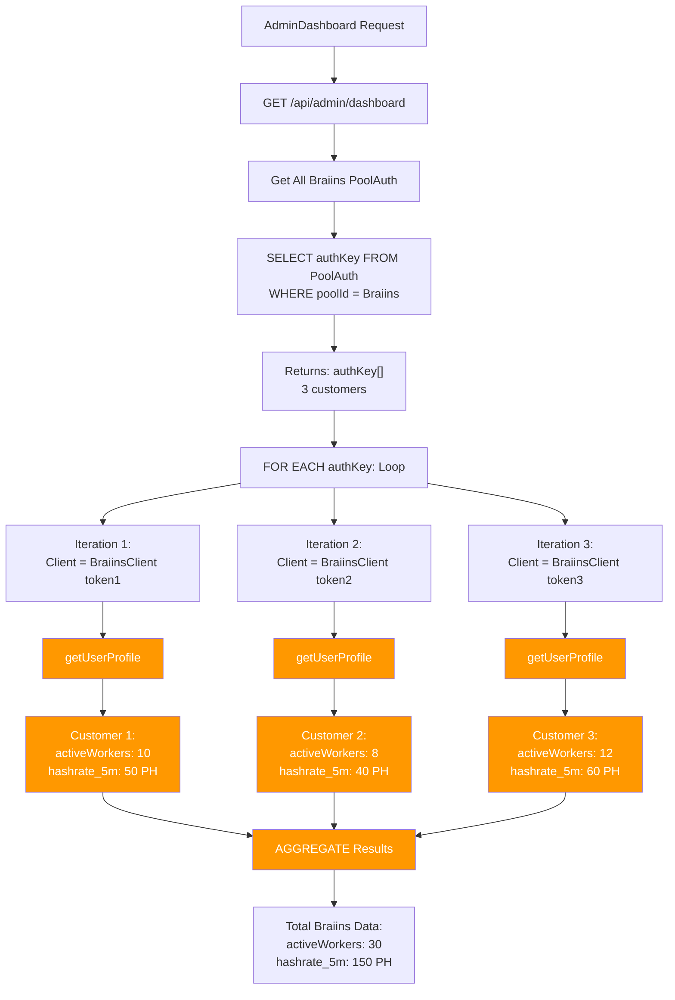
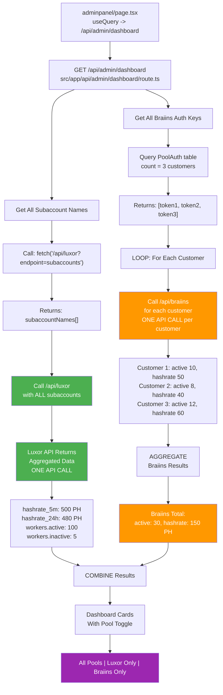

# Braiins vs Luxor API Architecture & Data Flow

**Last Updated:** April 18, 2026  
**Purpose:** Reference guide for understanding how to fetch mining pool data from Luxor and Braiins APIs  
**Audience:** Backend developers implementing features that need multi-pool statistics

---

## Table of Contents

1. [Quick Summary](#quick-summary)
2. [Architecture Overview](#architecture-overview)
3. [API Token Structure](#api-token-structure)
4. [Data Fetching Flow](#data-fetching-flow)
5. [Specific Cards Implementation](#specific-cards-implementation)
6. [Code Location Reference](#code-location-reference)
7. [Aggregation Patterns](#aggregation-patterns)
8. [Performance Considerations](#performance-considerations)
9. [New Page Implementation Guide](#new-page-implementation-guide)

---

## Quick Summary

| Aspect | Luxor | Braiins |
|--------|-------|---------|
| **API Model** | Workspace-level (single token, multiple subaccounts) | User-level (one token per customer) |
| **Token Count** | 1 admin token for entire workspace | 1 token per customer |
| **Multi-user Support** | ✅ YES - subaccounts in a single call | ❌ NO - one token = one data stream |
| **Aggregation** | Done by API | Must loop and aggregate manually |
| **API Calls for 3 customers** | ~3 calls for all data | 3+ calls (1 per customer) |
| **Subaccounts** | Explicit concept | N/A (flat structure) |
| **Auth Header** | `Authorization: Bearer {token}` | `Pool-Auth-Token: {token}` |

---

## Architecture Overview

### Luxor: Workspace-Level API

```
┌─────────────────────────────────────────────┐
│        Luxor Workspace (1 Admin Token)      │
├─────────────────────────────────────────────┤
│  Subaccount 1  │  Subaccount 2  │  Sub 3    │
│  (Customer A)  │  (Customer B)  │ (Cust C)  │
│  100 workers   │   75 workers   │  50 work  │
├─────────────────────────────────────────────┤
│   ONE API CALL returns data for ALL subs    │
│  GET /pool/summary/btc                      │
│     ?subaccount_names=Sub1,Sub2,Sub3        │
│  Returns: Aggregated hashrate, uptime, ... │
└─────────────────────────────────────────────┘
```

**Key Characteristics:**
- Single administrative API token (`LUXOR_API_KEY`)
- Workspace contains multiple **subaccounts**
- Each subaccount represents a logical mining operation
- Users can be assigned to specific subaccounts
- One API call can fetch data for multiple subaccounts simultaneously
- API returns **pre-aggregated** data

### Braiins: User-Level API

```
Customer 1                Customer 2              Customer 3
┌──────────────┐         ┌──────────────┐       ┌──────────────┐
│ API Token 1  │         │ API Token 2  │       │ API Token 3  │
│  40 workers  │         │  50 workers  │       │  30 workers  │
│ hashrate: X  │         │ hashrate: Y  │       │ hashrate: Z  │
└──────────────┘         └──────────────┘       └──────────────┘
       │                        │                     │
       └────────────────────────┴─────────────────────┘
              MUST MAKE SEPARATE API CALLS
              (One per customer's token)
              Then aggregate manually
```

**Key Characteristics:**
- Each customer has their own API token
- Token stored in database: `PoolAuth.authKey`
- Flat structure - no subaccount concept
- One token = exclusively that user's data
- Each API call is isolated to one customer
- **No built-in aggregation** - must loop and combine manually

---

## API Token Structure

### Luxor Tokens

```
Environment Variable: LUXOR_API_KEY
├── Used in: src/lib/luxor.ts
├── Scope: Entire workspace
└── Permissions: Access all subaccounts under the workspace

Example:
  LUXOR_API_KEY=sk_abc123xyz...
  │
  └─ Can fetch data for: Sub1, Sub2, Sub3, ... (all accessible subaccounts)
```

**How it's used:**
```typescript
// src/lib/luxor.ts
const LUXOR_API_KEY = process.env.LUXOR_API_KEY;

// Single client for entire workspace
const client = new LuxorClient(LUXOR_API_KEY, 'admin');

// Can fetch from ALL subaccounts
const summary = await client.getSummary({
  subaccount_names: ['Sub1', 'Sub2', 'Sub3'] // ONE call, all data
});
```

### Braiins Tokens

```
Database Table: PoolAuth
├── poolId: (points to Braiins pool)
├── userId: (customer/user ID)
└── authKey: "braiins_token_xyz"

Example:
  Customer 1: authKey = "token_abc123"
  Customer 2: authKey = "token_def456"
  Customer 3: authKey = "token_ghi789"

Each token is ISOLATED:
  token_abc123 → can ONLY access Customer 1's data
  token_def456 → can ONLY access Customer 2's data
  token_ghi789 → can ONLY access Customer 3's data
```

**How it's used:**
```typescript
// Must query database to get all tokens
const poolAuths = await prisma.poolAuth.findMany({
  where: { poolId: braiinsId },
  select: { authKey: true }
});
// Returns: [{ authKey: "token1" }, { authKey: "token2" }, { authKey: "token3" }]

// Then loop through each
for (const { authKey } of poolAuths) {
  const client = new BraiinsClient(authKey);
  const profile = await client.getUserProfile(); // ONE per customer
  aggregateData(profile);
}
```

---

## Data Fetching Flow

### Luxury Flow Diagram (Workspace-Level)



### Braiins Flow Diagram (User-Level with Loop)



### Combined Dashboard Request Flow



---

## Specific Cards Implementation

The following cards are used on the Admin Dashboard and other pages. Here's how each one fetches data:

### 1. Miners Card

**Components:** Active count, Inactive count, Review/Action required count

#### Luxor Implementation

```typescript
// src/app/api/admin/dashboard/route.ts - Line ~600-650

async function fetchLuxorMiners(request, subaccountNames) {
  // Step 1: Get database miners
  const luxorDbMiners = await prisma.miner.count({
    where: { poolId: luxorId, status: "AUTO", isDeleted: false }
  });

  // Step 2: Get API miners (if subaccounts exist)
  let apiActiveWorkers = 0;
  let apiInactiveWorkers = 0;
  
  if (subaccountNames.length > 0) {
    const workersData = await fetchAllWorkers(request, subaccountNames);
    // fetchAllWorkers makes ONE call to /api/luxor?endpoint=workers
    // Returns aggregated data for all subaccounts
    apiActiveWorkers = workersData.active;
    apiInactiveWorkers = workersData.inactive;
  }

  // Step 3: Calculate action required (orphans = DB miners - API active)
  const actionRequired = Math.max(0, luxorDbMiners - apiActiveWorkers);

  return { active: apiActiveWorkers, inactive: apiInactiveWorkers, actionRequired };
}
```

**API Calls Made:**
1. `GET /api/luxor?endpoint=workers` → Returns all workers for all subaccounts

#### Braiins Implementation

```typescript
// src/app/api/admin/dashboard/route.ts - Line ~700-750

async function fetchBraiinsMiners(request) {
  // Step 1: Get database miners
  const braiinsDbMiners = await prisma.miner.count({
    where: { poolId: braiinsId, status: "AUTO", isDeleted: false }
  });

  // Step 2: Get all Braiins authKeys
  const braiinsAuthKeys = await prisma.poolAuth.findMany({
    where: { poolId: braiinsId },
    select: { authKey: true }
  });
  // Returns: [{ authKey: "token1" }, { authKey: "token2" }, { authKey: "token3" }]

  // Step 3: Loop through EACH authKey
  let totalActiveWorkers = 0;
  let totalInactiveWorkers = 0;

  for (const { authKey } of braiinsAuthKeys) {
    try {
      const braiinsProfile = await fetchBraiinsProfile(authKey);
      // Created new BraiinsClient(authKey) inside fetchBraiinsProfile
      // Calls client.getUserProfile() for THIS customer
      
      if (braiinsProfile) {
        totalActiveWorkers += braiinsProfile.activeWorkers;
        totalInactiveWorkers += braiinsProfile.inactiveWorkers;
      }
    } catch (error) {
      console.error("Error fetching Braiins profile:", error);
      continue; // Continue with next customer
    }
  }

  // Step 4: Calculate action required
  const actionRequired = Math.max(0, braiinsDbMiners - totalActiveWorkers);

  return { 
    active: totalActiveWorkers, 
    inactive: totalInactiveWorkers, 
    actionRequired 
  };
}
```

**API Calls Made:**
1. `new BraiinsClient(token1).getUserProfile()` → Customer 1 data
2. `new BraiinsClient(token2).getUserProfile()` → Customer 2 data
3. `new BraiinsClient(token3).getUserProfile()` → Customer 3 data
4. Loop aggregates all results

### 2. Hashrate (5 min) & Hashrate (24 hours) Cards

#### Luxor Implementation

```typescript
// src/app/api/admin/dashboard/route.ts - Line ~400-450

async function fetchSummary(request, subaccountNames) {
  if (subaccountNames.length === 0) {
    return { hashrate_5m: 0, hashrate_24h: 0, uptime_24h: 0 };
  }

  const url = new URL("/api/luxor", request.url);
  url.searchParams.set("endpoint", "summary");
  url.searchParams.set("currency", "BTC");
  url.searchParams.set("subaccount_names", subaccountNames.join(","));
  // This ONE call aggregates data for all subaccounts

  const response = await fetch(luxorRequest);
  const result = await response.json();

  // Luxor API returns aggregated values directly
  return {
    hashrate_5m: (parseFloat(data.hashrate_5m) || 0) / 1000000000000000, // H/s to PH/s
    hashrate_24h: (parseFloat(data.hashrate_24h) || 0) / 1000000000000000,
    uptime_24h: (data.uptime_24h || 0) * 100 // Convert to percentage
  };
}
```

**Key Point:** Single API call returns aggregated hashrate for ALL subaccounts

```
Luxor Response:
{
  hashrate_5m: 500,        ← Already includes Sub1 + Sub2 + Sub3
  hashrate_24h: 480,       ← Already includes all subaccounts
  uptime_24h: 99.5
}
```

#### Braiins Implementation

```typescript
// In GET /api/admin/dashboard route.ts - Line ~950-1000

// Get all Braiins PoolAuth records
const braiinsPoolAuths = await prisma.poolAuth.findMany({
  where: { pool: { name: "Braiins" } },
  select: { authKey: true }
});

let totalHashrate5m = 0;
let totalHashrate24h = 0;

// Loop through EACH customer
for (const { authKey } of braiinsPoolAuths) {
  try {
    const braiinsProfile = await fetchBraiinsProfile(authKey);
    // fetchBraiinsProfile creates new BraiinsClient(authKey)
    // and calls client.getUserProfile()
    
    if (braiinsProfile) {
      totalHashrate5m += braiinsProfile.hashrate_5m;      // Customer 1's hashrate
      totalHashrate24h += braiinsProfile.hashrate_24h;    // Customer 1's hashrate
    }

    const braiinsRevenue = await fetchBraiinsRevenue(authKey);
    // Separate call for revenue (getDailyRewards)
    if (braiinsRevenue) {
      totalRevenue += braiinsRevenue.revenue;
    }
  } catch (error) {
    console.error("Error fetching Braiins data:", error);
    continue;
  }
}

braiinsStats = {
  hashrate_5m: totalHashrate5m,    // Manually aggregated
  hashrate_24h: totalHashrate24h,  // Manually aggregated
  workers: { /* workers */ }
};
```

**Key Point:** Must loop and aggregate manually

```
Braiins Data Flow:
Customer 1: hashrate_5m = 50  ┐
Customer 2: hashrate_5m = 40  ├─ AGGREGATE
Customer 3: hashrate_5m = 60  ┘
              TOTAL = 150
```

### 3. Total Workers, Active Workers, Inactive Workers Cards

#### Luxor Implementation

```typescript
// src/app/api/admin/dashboard/route.ts - Line ~320-360

async function fetchAllWorkers(request, subaccountNames) {
  const url = new URL("/api/luxor", request.url);
  url.searchParams.set("endpoint", "workers");
  url.searchParams.set("page_number", "1");
  url.searchParams.set("page_size", "1000");
  url.searchParams.set("site_id", process.env.LUXOR_FIXED_SITE_ID || "");
  // Fetches ALL workers for all subaccounts in ONE call

  const response = await fetch(luxorRequest);
  const result = await response.json();

  if (result.data?.workers) {
    return {
      active: result.data.total_active,      // Already aggregated
      inactive: result.data.total_inactive,  // Already aggregated
      total: result.data.total_active + result.data.total_inactive,
      activeHashrate: sumOfActiveWorkerHashrates,
      inactiveHashrate: sumOfInactiveWorkerHashrates
    };
  }
}
```

#### Braiins Implementation

```typescript
// Handled in fetchBraiinsProfile which is called for each customer

let totalActiveWorkers = 0;
let totalInactiveWorkers = 0;
let totalWorkers = 0;

for (const { authKey } of braiinsAuthKeys) {
  const braiinsProfile = await fetchBraiinsProfile(authKey);
  
  // Extract worker counts from this customer
  const customerActive = braiinsProfile.activeWorkers;      // ok_workers
  const customerInactive = braiinsProfile.inactiveWorkers;  // dis + low + off workers
  
  totalActiveWorkers += customerActive;
  totalInactiveWorkers += customerInactive;
}

totalWorkers = totalActiveWorkers + totalInactiveWorkers;
```

---

## Code Location Reference

### Main Files

| File | Purpose | Key Functions |
|------|---------|---------------|
| `src/app/api/admin/dashboard/route.ts` | Main dashboard API endpoint | `GET()`, `fetchLuxorMiners()`, `fetchBraiinsMiners()`, `fetchSummary()`, `fetchAllWorkers()` |
| `src/app/(manage)/adminpanel/page.tsx` | Admin dashboard UI component | Dashboard cards, pool mode toggle |
| `src/lib/luxor.ts` | Luxor API client | `getSummary()`, `getWorkers()`, `getSubaccounts()` |
| `src/lib/braiins.ts` | Braiins API client | `getUserProfile()`, `getDailyRewards()`, `getWorkers()` |

### Key Function Locations in Dashboard Route

```
src/app/api/admin/dashboard/route.ts
├── Line ~100-180: Helper getAllSubaccountNames()
├── Line ~280-360: Helper fetchAllWorkers()
├── Line ~400-450: Helper fetchSummary()
├── Line ~500-530: Helper fetchBraiinsProfile()
├── Line ~550-580: Helper fetchBraiinsRevenue()
├── Line ~600-650: Helper fetchLuxorMiners()
├── Line ~700-780: Helper fetchBraiinsMiners() ← Important!
├── Line ~800-900: Luxor stats aggregation
├── Line ~920-1050: Braiins stats aggregation (LOOP THROUGH CUSTOMERS)
└── Line ~1100-1200: Final response construction
```

---

## Aggregation Patterns

### Pattern 1: Luxor Single-Call Aggregation

```typescript
// Problem: Need hashrate from all subaccounts
// Solution: One API call with all subaccount names

const subaccountNames = ['Sub1', 'Sub2', 'Sub3'];

const summary = await client.getSummary({
  subaccount_names: subaccountNames.join(',')
});

// Result: Already aggregated
console.log(summary.hashrate_5m);  // 500 (Sub1 + Sub2 + Sub3 combined)
```

**Advantages:**
- ✅ Single API call
- ✅ Atomic transaction (all or nothing)
- ✅ No manual aggregation logic
- ✅ Fast response

### Pattern 2: Braiins Loop-and-Aggregate

```typescript
// Problem: Each Braiins token only has access to one customer's data
// Solution: Loop through each token and aggregate manually

const authKeys = await prisma.poolAuth.findMany({ where: { poolId: braiinsId } });

let totalHashrate = 0;
const results = [];

for (const { authKey } of authKeys) {
  try {
    const client = new BraiinsClient(authKey);
    const profile = await client.getUserProfile();
    
    results.push({
      customerId: authKey,
      hashrate: profile.btc.hash_rate_5m,
      workers: profile.btc.ok_workers
    });
    
    totalHashrate += profile.btc.hash_rate_5m;
  } catch (error) {
    console.error(`Failed for authKey:`, error);
    // Continue with next customer
  }
}

console.log(totalHashrate);  // Manually aggregated
```

**Considerations:**
- ⚠️ Multiple API calls (one per customer)
- ⚠️ Error in one doesn't fail entire operation (continue loop)
- ⚠️ Slower (sequential calls)
- ✅ Flexible error handling

### Pattern 3: Combining Both Pools

```typescript
// Get data from both Luxor and Braiins, then combine

const luxorData = await fetchLuxorStats(request, subaccountNames);
const braiinsData = await fetchBraiinsStats();

const combinedStats = {
  totalHashrate5m: luxorData.hashrate_5m + braiinsData.hashrate_5m,
  totalActiveWorkers: luxorData.workers.active + braiinsData.workers.active,
  totalInactiveWorkers: luxorData.workers.inactive + braiinsData.workers.inactive,
  poolBreakdown: {
    luxor: luxorData,
    braiins: braiinsData
  }
};
```

---

## Performance Considerations

### Luxor Performance

```
Subaccounts: 3
API Calls: ~3-4
├── GET /api/luxor?endpoint=subaccounts       (1 call, ~200ms)
├── GET /api/luxor?endpoint=workers           (1 call, ~300ms)
├── GET /api/luxor?endpoint=summary           (1 call, ~300ms)
└── GET /api/luxor?endpoint=revenue           (1 call, ~400ms)
    ────────────────────────────────────
    Total: ~1.2 seconds

Characteristics:
✅ Fast (fixed number of calls)
✅ Predictable (doesn't scale with customer count)
✅ Atomic (all or nothing)
```

### Braiins Performance

```
Customers: 3
API Calls: 3 × 2 = 6
├── Loop 1: client.getUserProfile()          (~200ms)
├── Loop 1: client.getDailyRewards()         (~300ms)
├── Loop 2: client.getUserProfile()          (~200ms)
├── Loop 2: client.getDailyRewards()         (~300ms)
├── Loop 3: client.getUserProfile()          (~200ms)
└── Loop 3: client.getDailyRewards()         (~300ms)
    ────────────────────────────────────
    Total: ~1.5 seconds (but varies with customer count)

Characteristics:
⚠️ Scales with customer count
⚠️ Sequential (not parallelized)
⚠️ Can fail partially (continue on error)
```

### Optimization Opportunities

#### For Braiins Only

1. **Parallel Requests** (Currently sequential)
   ```typescript
   // Instead of:
   for (const { authKey } of authKeys) {
     const profile = await fetchBraiinsProfile(authKey); // Waits
   }

   // Could do:
   const profiles = await Promise.all(
     authKeys.map(({ authKey }) => fetchBraiinsProfile(authKey))
   );
   ```

2. **Caching**
   ```typescript
   // Cache Braiins customer profiles for 5 minutes
   // Only refresh on user request or scheduled task
   const cachedProfiles = await redis.get(`braiins-profile-${customerId}`);
   if (cachedProfiles) {
     return JSON.parse(cachedProfiles);
   }
   ```

3. **Separate Endpoints**
   ```typescript
   // Create /api/braiins-stats that only fetches profile data
   // Create /api/braiins-revenue that only fetches daily rewards
   // Allow dashboard to call them separately/conditionally
   ```

---

## New Page Implementation Guide

When creating a new page that needs Luxor and Braiins data, follow these patterns:

### Step 1: Plan Your Data Structure

```typescript
interface PageStats {
  luxor?: {
    workers: { active: number; inactive: number; total: number };
    hashrate_5m: number;
    hashrate_24h: number;
    // ... other fields
  };
  braiins?: {
    workers: { active: number; inactive: number; total: number };
    hashrate_5m: number;
    hashrate_24h: number;
    // ... other fields
  };
  combined?: {
    workers: { active: number; inactive: number; total: number };
    hashrate_5m: number;
    hashrate_24h: number;
  };
}
```

### Step 2: Create the API Endpoint

```typescript
// src/app/api/your-endpoint/route.ts

export async function GET(request: NextRequest) {
  try {
    // 1. Authentication
    const token = request.cookies.get("token")?.value;
    if (!token) return NextResponse.json({ error: "Unauthorized" }, { status: 401 });

    // 2. Fetch Luxor data (single call)
    let luxorData = null;
    try {
      const subaccountNames = await getAllSubaccountNames(request);
      luxorData = await fetchLuxorYourData(request, subaccountNames);
    } catch (error) {
      console.error("Luxor error:", error);
    }

    // 3. Fetch Braiins data (loop through customers)
    let braiinsData = null;
    try {
      braiinsData = await fetchBraiinsYourData();
    } catch (error) {
      console.error("Braiins error:", error);
    }

    // 4. Combine results
    const combined = {
      luxor: luxorData,
      braiins: braiinsData,
      combined: mergeLuxorBraiins(luxorData, braiinsData)
    };

    return NextResponse.json({ success: true, data: combined });
  } catch (error) {
    return NextResponse.json({ error: "Server error" }, { status: 500 });
  }
}
```

### Step 3: Helper Functions

```typescript
// For Luxor (simple)
async function fetchLuxorYourData(request, subaccountNames) {
  // Single Luxor API call
  const response = await fetch(/*...*/);
  return response.json();
}

// For Braiins (loop-based)
async function fetchBraiinsYourData() {
  // Get all Braiins tokens
  const authKeys = await prisma.poolAuth.findMany({
    where: { pool: { name: "Braiins" } },
    select: { authKey: true }
  });

  let aggregatedData = { /* initial values */ };

  // Loop through each customer
  for (const { authKey } of authKeys) {
    try {
      const client = new BraiinsClient(authKey);
      const data = await client.getYourData();
      // Aggregate data
      aggregateIntoResult(aggregatedData, data);
    } catch (error) {
      console.error("Error for authKey:", error);
      continue;
    }
  }

  return aggregatedData;
}
```

### Step 4: Frontend Component

```typescript
// src/app/your-page.tsx

"use client";

export default function YourPage() {
  const { data } = useQuery({
    queryKey: ["yourPageStats"],
    queryFn: async () => {
      const response = await fetch("/api/your-endpoint");
      return response.json();
    },
    staleTime: 5 * 60 * 1000 // 5 minutes
  });

  const [poolMode, setPoolMode] = useState<"total" | "luxor" | "braiins">("total");

  const getStats = (mode) => {
    if (mode === "luxor") return data?.data?.luxor;
    if (mode === "braiins") return data?.data?.braiins;
    return data?.data?.combined;
  };

  return (
    <div>
      <button onClick={() => setPoolMode("total")}>All Pools</button>
      <button onClick={() => setPoolMode("luxor")}>Luxor</button>
      <button onClick={() => setPoolMode("braiins")}>Braiins</button>

      {/* Display cards based on poolMode */}
    </div>
  );
}
```

---

## Common Patterns & Best Practices

### Error Handling

**Luxor (Atomic):**
```typescript
try {
  const data = await fetchLuxorData();
  return data; // All or nothing
} catch (error) {
  return null; // Entire operation failed
}
```

**Braiins (Partial Tolerance):**
```typescript
const results = [];
for (const { authKey } of authKeys) {
  try {
    const data = await fetchBraiinsData(authKey);
    results.push(data);
  } catch (error) {
    console.warn(`Customer ${authKey} failed, continuing...`);
    continue; // Continue with next customer
  }
}
// Return partial results (even if some failed)
return aggregateResults(results);
```

### Data Normalization

Since both pools return data in different formats, normalize at the API layer:

```typescript
// src/lib/poolNormalization.ts

export function normalizeLuxorWorker(luxorWorker) {
  return {
    name: luxorWorker.name,
    status: luxorWorker.status === "ACTIVE" ? "ACTIVE" : "INACTIVE",
    hashrate: luxorWorker.hashrate, // H/s
    timestamp: Date.now()
  };
}

export function normalizeBraiinsWorker(braiinsWorker) {
  const status = braiinsWorker.state === "ok" ? "ACTIVE" : "INACTIVE";
  return {
    name: braiinsWorker.name,
    status,
    hashrate: braiinsWorker.hash_rate_5m, // H/s
    timestamp: Date.now()
  };
}
```

### Caching Strategy

```typescript
// For Luxor: Cache for 5 minutes (data refreshes less frequently)
const luxorCacheKey = `luxor-stats-${subaccountNames.join(',')}`;
const cached = await redis.get(luxorCacheKey);
if (cached) return JSON.parse(cached);

// For Braiins: Cache per customer for 2-3 minutes
const braiinsCacheKey = `braiins-profile-${authKey}`;
const cached = await redis.get(braiinsCacheKey);
if (cached) return JSON.parse(cached);
```

---

## Troubleshooting

### Issue: "No subaccounts found"

**Cause:** Luxor returns empty subaccount list  
**Solution:**
1. Check `LUXOR_API_KEY` is set correctly
2. Verify users have `luxorSubaccountName` filled in database
3. Check Luxor workspace has accessible subaccounts

### Issue: Braiins data missing for some customers

**Cause:** Invalid authKey or API token issue  
**Solution:**
1. Check `PoolAuth.authKey` is valid Braiins token
2. Check customer's Braiins account is not deleted/suspended
3. Error is caught in loop, continue with next customer (check logs)

### Issue: Slow dashboard load time

**Cause:** Multiple sequential Braiins API calls  
**Solution:**
1. Enable caching in Redis
2. Parallelize Braiins calls with `Promise.all()`
3. Increase `staleTime` in React Query to reduce refetches
4. Consider separate endpoints for different data types

---

## References

- **Luxor API V2 Docs:** `https://app.luxor.tech/api/v2` (internal API reference)
- **Braiins Pool Docs:** `https://pool.braiins.com/api`
- **Dashboard Implementation:** [src/app/api/admin/dashboard/route.ts](../../src/app/api/admin/dashboard/route.ts)
- **Admin Panel UI:** [src/app/(manage)/adminpanel/page.tsx](../../src/app/(manage)/adminpanel/page.tsx)

---

## Document History

| Date | Author | Changes |
|------|--------|---------|
| 2026-04-18 | AI Assistant | Initial creation - comprehensive Luxor vs Braiins architecture guide |

